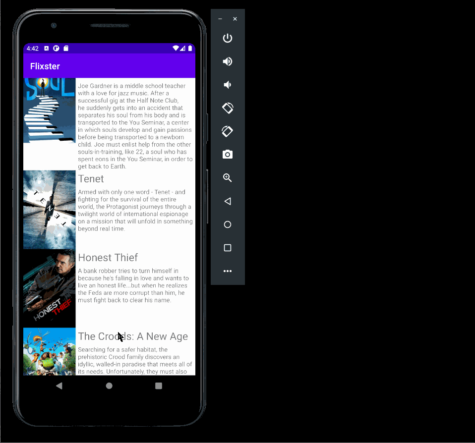

# Flixster
Flixster is an app that allows users to browse movies from [The Movie Database API](https://developers.themoviedb.org/3/getting-started/introduction).

## Flixster Part 2

### User Stories

#### REQUIRED (10pts)

- [x] (8pts) Expose details of movie (ratings using RatingBar, popularity, and synopsis) in a separate activity.
- [x] (2pts) Allow video posts to be played in full-screen using the YouTubePlayerView.

#### BONUS

- [ ] Implement a shared element transition when user clicks into the details of a movie (1 point).
- [ ] Trailers for popular movies are played automatically when the movie is selected (1 point).
  - [ ] When clicking on a popular movie (i.e. a movie voted for more than 5 stars) the video should be played immediately.
  - [ ] Less popular videos rely on the detailed page should show an image preview that can initiate playing a YouTube video.
- [ ] Add a play icon overlay to popular movies to indicate that the movie can be played (1 point).
- [ ] Apply data binding for views to help remove boilerplate code. (1 point)
- [ ] Add a rounded corners for the images using the Glide transformations. (1 point)

### App Walkthough GIF

 

### Notes
The challenge faced this time was when landscape mode was not working anymore. When the phone was rotated and was supposed to enter landscape mode the app would just crash. So I assumed it was due to an mistake in the coding but after hours of searching the reason behind it was due to the item_moviexml(land) not having a name for id. After naming it container the issue was resolved. 

## Flixster Part 1

### User Stories
#### REQUIRED (10pts)
- [x] (10pts) User can view a list of movies (title, poster image, and overview) currently playing in theaters from the Movie Database API.

#### BONUS
- [x] (2pts) Views should be responsive for both landscape/portrait mode.
   - [x] (1pt) In portrait mode, the poster image, title, and movie overview is shown.
   - [x] (1pt) In landscape mode, the rotated alternate layout should use the backdrop image instead and show the title and movie overview to the right of it.

- [ ] (2pts) Display a nice default [placeholder graphic](https://guides.codepath.org/android/Displaying-Images-with-the-Glide-Library#advanced-usage) for each image during loading
- [x] (2pts) Improved the user interface by experimenting with styling and coloring.
- [ ] (2pts) For popular movies (i.e. a movie voted for more than 5 stars), the full backdrop image is displayed. Otherwise, a poster image, the movie title, and overview is listed. Use Heterogenous RecyclerViews and use different ViewHolder layout files for popular movies and less popular ones.

### App Walkthough GIF
 

### Notes
Most challenges faced were being able to follow some steps as the Android Studio has updated from the version shown in the videos so some steps had some added steps that I had to figure out on my own. Also the person who is explaining the steps would use a shortcut to do something and I also had to figure out on my own how he got to that setting.
Besides that all other challenges were just techinical issues such as minSdkVersion was set to version 16 and I had to change it to version 21. When importing the project entering my login information just doesn't work for some reason so I had to use a token instead. But I still had issues importing and I had to enter stuff into Git bash.

### Open-source libraries used

- [Android Async HTTP](https://github.com/codepath/CPAsyncHttpClient) - Simple asynchronous HTTP requests with JSON parsing
- [Glide](https://github.com/bumptech/glide) - Image loading and caching library for Androids
